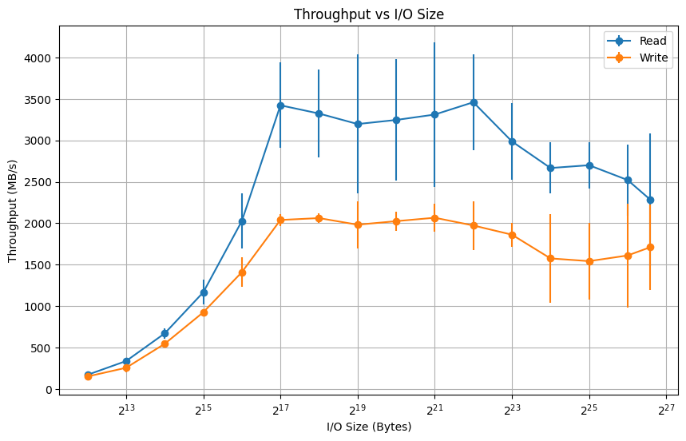
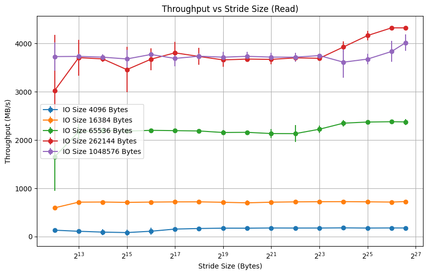
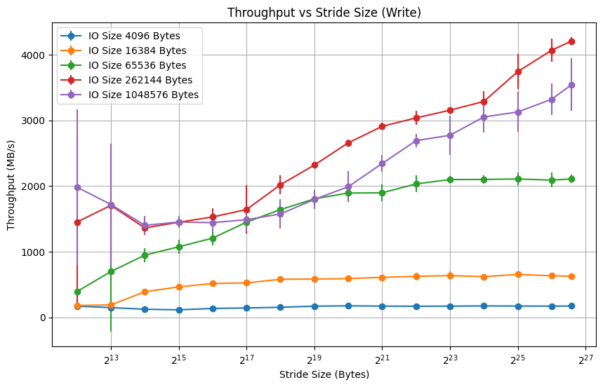
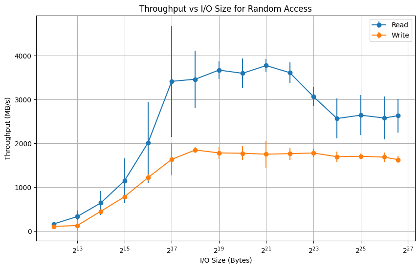

## Lab 5 Report

### PIDs: 730470219, 730466997, 730411082

### Data Collected from Running on a 1GB Test File on Mac (SSD)

### Sequential Access

In this experiment, throughput is plotted against the I/O size, ranging from 4 KB to 100 MB, with the graph reporting the mean throughput and 95% confidence intervals for each point. The data shows a significant increase in throughput as the I/O size grows, with a peak performance observed between 256 KB and 1 MB. Reads achieve the highest throughput, hovering at 3500 MB/s, before a slight decline beyond 1 MB, possibly due to system overheads like buffer management or caching inefficiencies. Write throughput follows a slower increase and plateaus around 2000 MB/s. 

These results indicate that larger I/O sizes, up to 1 MB, are optimal for maximizing throughput in sequential access scenarios, particularly for read-intensive tasks. Beyond this range, the performance gain diminishes. For applications or file systems handling sequential workloads, choosing an I/O size around 256 KB to 1 MB is ideal for balancing performance and overhead.

---

### Stride Read

This experiment highlights the relationship between I/O size and stride size. For small I/O sizes (4 KB, 16 KB, and 64 KB), throughput remains consistently low across all stride sizes, indicating that small I/O sizes underutilize system bandwidth regardless of the stride. Medium I/O sizes, such as 256 KB, show a significant improvement, with throughput stabilizing around 3000-4000 MB/s across stride sizes, suggesting that this range strikes a balance between efficiency and system overhead. Larger I/O sizes, like 1 MB, achieve the highest throughput (approximately 4000 MB/s) consistently across all stride sizes, with minimal variability, demonstrating that the system is well-optimized for handling large reads.

Overall, read operations are influenced more by I/O size than stride size, with larger I/O sizes (256 KB to 1 MB) ensuring optimal performance.

---

### Stride Write

This experiment of throughput versus stride size for write operations shows a different trend where both I/O size and stride size play a significant role. Small I/O sizes (4 KB and 16 KB) exhibit low and consistent throughput (below 500 MB/s), regardless of the stride size, as they incur higher overhead per operation. Medium to larger I/O sizes (64 KB, 256 KB, 1 MB) show steady improvement as stride size increases, peaking at approximately 3500-4000 MB/s for the largest strides, indicating that reducing overhead through larger strides benefits writes. 

However, it seems that the larger I/O sizes (1 MB) demonstrate slightly worse performance compared to 256 KB. This suggests that excessively large I/O sizes, like 1 MB, may introduce additional overheads such as buffer management inefficiencies, increased synchronization costs, or delays in write flushing. While larger strides help alleviate contention and improve throughput for larger I/O sizes, the marginal difference in performance between 256 KB and 1 MB suggests that 256 KB may strike the best balance between reducing overhead and maximizing throughput.

---

### Random Access

For random I/O patterns, throughput is again plotted against the I/O size, with granularity ranging from 4 KB to 100 MB over a range of 1 GB addresses. The graph reveals a similar upward trend as I/O size increases, but the peak throughput for random reads is slightly lower compared to sequential reads, reaching around 3750 MB/s at 512 KB to 1 MB before declining. Write throughput is relatively stable, plateauing between 1500 MB/s and 2000 MB/s, and is less sensitive to changes in I/O size. 

The confidence intervals show higher variability in random access performance, especially for larger I/O sizes, likely due to increased latency, cache misses, or hardware limitations. These results suggest that for applications requiring random access, an I/O size around 512 KB offers the best trade-off between throughput and variability.
